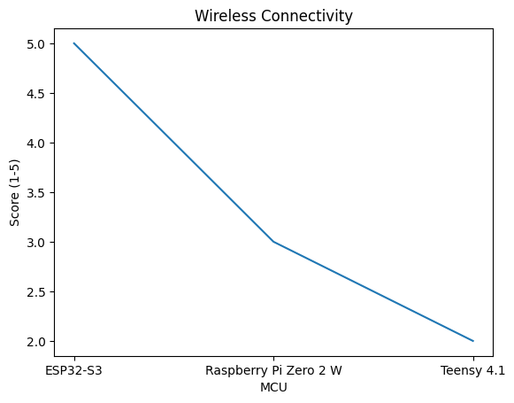
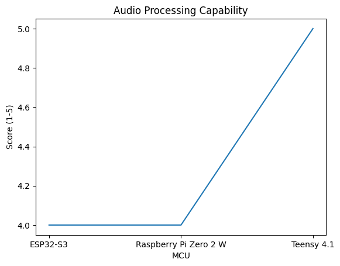
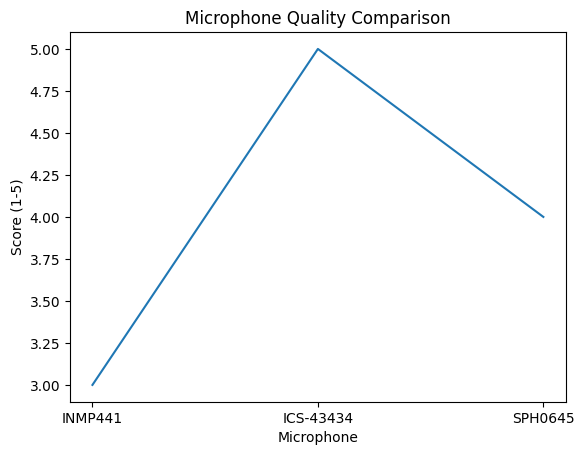
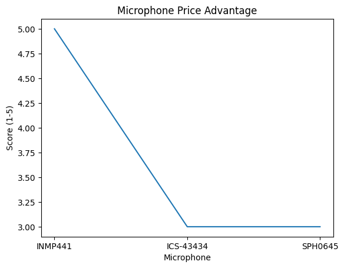
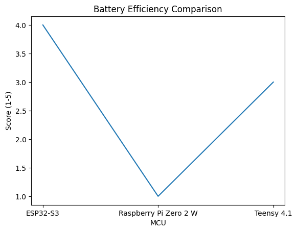

<div align="center">

# 🧠 NOTITIA NODE
### Benchmark Composants & Liste Prototype


---

*"Libérez votre esprit, nous gardons le reste."*

</div>

---

## 📋 Table des Matières

- [🎯 Objectif du Prototype](#-objectif-du-prototype)
- [🛒 Liste Complète des Composants](#-liste-complète-des-composants)
- [🔬 Benchmark Détaillé](#-benchmark-détaillé)
  - [🖥️ Microcontrôleurs](#️-microcontrôleurs)
  - [🎙️ Microphones MEMS](#️-microphones-mems)
  - [💡 Indicateurs Lumineux](#-indicateurs-lumineux)
  - [💾 Stockage](#-stockage)
  - [🔋 Alimentation](#-alimentation)
  - [📡 Transmission des Données](#-transmission-des-données)
- [✅ Recommandation Finale](#-recommandation-finale)

---

## 🎯 Objectif du Prototype

> **But :** Créer un module fonctionnel capable d'**enregistrer de l'audio** et de **transférer les données** via Bluetooth vers l'application Notitia.

### Fonctionnalités Clés du Prototype

| Fonctionnalité | Description | Priorité |
|:---:|:---|:---:|
| 🎙️ **Capture Audio** | Double micro MEMS pour enregistrement haute fidélité | 🔴 Critique |
| 💡 **LED Transparence** | Anneau LED (Bleu=Veille, Rouge=Enregistrement) | 🔴 Critique |
| 📡 **Transfert BLE** | Synchronisation Bluetooth avec l'application | 🔴 Critique |
| 💾 **Stockage Local** | Carte microSD pour mode Standalone | 🟡 Important |
| 🔘 **Bouton Marquage** | Marquer les moments importants | 🟢 Bonus |

---

## 🛒 Liste Complète des Composants

### 📦 Kit Prototype Complet — Qualité Prioritaire

> **Budget estimé : 120-150€** (livraison Amazon Prime incluse)
> 
> ⚠️ **Philosophie :** On privilégie la **fiabilité** et la **qualité** pour un prototype qui fonctionne du premier coup. Pas de composants low-cost douteux.

---

### 🎯 Composants Principaux (Critiques)

| # | Composant | Modèle Recommandé | Qté | Prix | Lien Amazon FR |
|:---:|:---|:---|:---:|:---:|:---:|
| 1 | 🖥️ **Microcontrôleur** | **ESP32-S3-DevKitC-1 N16R8** (16MB Flash, 8MB PSRAM) | 1 | ~22€ | [🛒 Amazon](https://www.amazon.fr/dp/B0CLLKR7YM) |
| 2 | 🎙️ **Microphone MEMS** | **INMP441 I2S** (module breakout) | 2 | ~9€/pièce | [🛒 Amazon](https://www.amazon.fr/dp/B09MFGV8G5) |
| 3 | 💡 **LED Ring** | **WS2812B Ring 16 LEDs** (diamètre 68mm) | 1 | ~12€ | [🛒 Amazon](https://www.amazon.fr/dp/B08XQGP89N) |
| 4 | 💾 **Module SD** | **Module microSD SPI** (avec régulateur 3.3V intégré) | 1 | ~8€ | [🛒 Amazon](https://www.amazon.fr/dp/B077MB17JB) |
| 5 | 💾 **Carte SD** | **SanDisk Ultra 32 Go** (Classe 10, A1) | 1 | ~9€ | [🛒 Amazon](https://www.amazon.fr/dp/B08GY9NYRM) |

---

### 🔋 Alimentation (Qualité = Sécurité)

| # | Composant | Modèle Recommandé | Qté | Prix | Lien Amazon FR |
|:---:|:---|:---|:---:|:---:|:---:|
| 6 | 🔋 **Batterie LiPo** | **EEMB 3.7V 2000mAh** (avec connecteur JST, protection intégrée) | 1 | ~15€ | [🛒 Amazon](https://www.amazon.fr/dp/B08FD39Y5R) |
| 7 | 🔌 **Module Charge** | **TP4056 Type-C** (avec protection DW01) - Pack de 5 | 1 | ~10€ | [🛒 Amazon](https://www.amazon.fr/dp/B08HLYS12Y) |
| 8 | ⚡ **Régulateur** | **AMS1117 3.3V** (module régulateur) | 1 | ~7€ | [🛒 Amazon](https://www.amazon.fr/dp/B08DHRZ8MX) |

---

### 🔘 Interface Utilisateur

| # | Composant | Modèle Recommandé | Qté | Prix | Lien Amazon FR |
|:---:|:---|:---|:---:|:---:|:---:|
| 9 | 🔘 **Bouton Marquage** | **Bouton poussoir 12mm** métallique LED (pack de 5) | 1 | ~12€ | [🛒 Amazon](https://www.amazon.fr/dp/B0B8JH4D6W) |
| 10 | 🔊 **Buzzer** (optionnel) | **Buzzer passif 3.3V** (feedback sonore) | 1 | ~6€ | [🛒 Amazon](https://www.amazon.fr/dp/B07VQV27X3) |

---

### 🔧 Kit Prototypage

| # | Composant | Modèle Recommandé | Qté | Prix | Lien Amazon FR |
|:---:|:---|:---|:---:|:---:|:---:|
| 11 | 🧪 **Breadboard** | **Elegoo Breadboard 830 points** (qualité supérieure) | 2 | ~10€ | [🛒 Amazon](https://www.amazon.fr/dp/B01N4VCYUK) |
| 12 | 🔌 **Câbles Dupont** | **Kit 120 pcs M/M + M/F + F/F** (qualité Elegoo) | 1 | ~8€ | [🛒 Amazon](https://www.amazon.fr/dp/B01JD5WCG2) |
| 13 | 🔗 **Câble USB-C** | **Câble USB-C données + charge 1m** (qualité Anker/Ugreen) | 1 | ~10€ | [🛒 Amazon](https://www.amazon.fr/dp/B07CJJHVKX) |
| 14 | 📦 **Résistances** | **Kit résistances 1/4W** (220Ω, 330Ω, 1K, 10K) | 1 | ~8€ | [🛒 Amazon](https://www.amazon.fr/dp/B08FD1XVL6) |
| 15 | 🔩 **Condensateurs** | **Kit condensateurs céramique** (100nF, 10µF) | 1 | ~8€ | [🛒 Amazon](https://www.amazon.fr/dp/B0B2R7N1NF) |

---

### 🛠️ Outils Recommandés

| Outil | Modèle Recommandé | Prix | Lien Amazon FR | Indispensable ? |
|:---|:---|:---:|:---:|:---:|
| 🔥 **Station Soudure** | Handskit 60W température réglable | ~25€ | [🛒 Amazon](https://www.amazon.fr/dp/B0BGLGLFM6) | ✅ Oui |
| 🔬 **Multimètre** | AstroAI Digital Multimeter | ~15€ | [🛒 Amazon](https://www.amazon.fr/dp/B01ISAMUA6) | ✅ Oui |
| 🧰 **Kit Soudure** | Étain + Flux + Pompe à dessouder | ~15€ | [🛒 Amazon](https://www.amazon.fr/dp/B0BHJCBBPX) | ✅ Oui |
| 🔍 **Loupe LED** | Loupe mains libres avec LED | ~18€ | [🛒 Amazon](https://www.amazon.fr/dp/B0BXH5R2PZ) | 🟡 Utile |
| 🗜️ **Troisième Main** | Support PCB avec pinces | ~15€ | [🛒 Amazon](https://www.amazon.fr/dp/B09N3LRMHC) | 🟡 Utile |

---

### 💰 Récapitulatif Budget

| Catégorie | Sous-total |
|:---|:---:|
| 🎯 Composants Principaux | ~60€ |
| 🔋 Alimentation | ~32€ |
| 🔘 Interface | ~18€ |
| 🔧 Prototypage | ~44€ |
| **TOTAL Composants** | **~154€** |
| 🛠️ Outils (si besoin) | +88€ |
| **TOTAL avec Outils** | **~242€** |

> 💡 **Note :** Les outils sont un investissement one-shot réutilisable pour tout le projet. Si l'équipe possède déjà du matériel de soudure, le budget descend à **~150€**.

---

## 🔬 Benchmark Détaillé

---

### 🖥️ Microcontrôleurs

> Le cerveau du Notitia Node - Choix critique pour la réussite du projet

| Critère | ESP32-S3-DevKitC-1 N16R8 | Raspberry Pi Zero 2 W | Teensy 4.1 |
|:---|:---:|:---:|:---:|
| **Image** |  | - | - |
| **Prix Amazon** | **~22€** | ~25€ | ~45€ |
| **Flash / PSRAM** | 16MB / 8MB | SD Card | 8MB / 1MB |
| **WiFi** | ✅ Intégré | ✅ Intégré | ❌ Non |
| **Bluetooth LE 5.0** | ✅ Intégré | ✅ Intégré | ❌ Non |
| **Consommation Active** | 🟢 ~100mA | 🔴 ~400mA | 🟡 ~150mA |
| **DSP Audio** | ✅ Optimisé Vector | ⚠️ Software only | ✅ Excellent |
| **I2S (Micros)** | ✅ 2x Natifs | ✅ Natif | ✅ Natif |
| **USB Natif** | ✅ OTG | ❌ Micro-USB | ✅ Host |
| **Documentation** | 🟢 Excellente | 🟢 Excellente | 🟡 Bonne |
| **Boot Time** | ⚡ <1 sec | 🐢 ~20 sec | ⚡ Instantané |
| **Complexité Setup** | 🟢 Simple | 🔴 OS Linux requis | 🟡 Moyenne |

#### 📊 Score Final Microcontrôleurs

| Modèle | Pertinence Prototype | Recommandation |
|:---|:---:|:---:|
| **ESP32-S3** | ⭐⭐⭐⭐⭐ | 🏆 **CHOIX RECOMMANDÉ** |
| Raspberry Pi Zero 2 W | ⭐⭐⭐ | ⚠️ Trop complexe pour proto |
| Teensy 4.1 | ⭐⭐⭐ | ❌ Pas de Bluetooth natif |

> 💡 **Pourquoi l'ESP32-S3 ?**
> - BLE/WiFi intégrés = moins de composants
> - DSP optimisé pour traitement audio
> - Parfait pour le prototypage rapide
> - Énorme communauté et exemples disponibles

---

### 🎙️ Microphones MEMS

> Capturer chaque mot avec précision - Essentiel pour Notitia

| Critère | INMP441 | ICS-43434 | SPH0645LM4H |
|:---|:---:|:---:|:---:|
| **Image** |  |  |  |
| **Prix Amazon** | **~9€** | ~15€ | ~12€ |
| **Interface** | I2S | I2S | I2S |
| **SNR** | 61 dB | 65 dB | 65 dB |
| **Sensibilité** | -26 dBFS | -26 dBFS | -26 dBFS |
| **Bande passante** | 50Hz - 15kHz | 50Hz - 20kHz | 50Hz - 20kHz |
| **Alimentation** | 3.3V | 3.3V | 3.3V |
| **Qualité Audio** | 🟢 Bonne | 🟢 Très Bonne | 🟢 Très Bonne |
| **Disponibilité Amazon** | 🟢 Excellente | 🟡 Moins courante | 🟡 Bonne |
| **Facilité Setup ESP32** | ⭐⭐⭐⭐⭐ | ⭐⭐⭐⭐ | ⭐⭐⭐⭐ |
| **Exemples Code** | 🟢 Nombreux | 🟡 Quelques-uns | 🟡 Quelques-uns |

#### 📊 Score Final Microphones

| Modèle | Score | Recommandation |
|:---|:---:|:---:|
| **INMP441** | ⭐⭐⭐⭐⭐ | 🏆 **CHOIX RECOMMANDÉ** (Proto) |
| ICS-43434 | ⭐⭐⭐⭐ | 💎 Option Premium (Prod) |
| SPH0645LM4H | ⭐⭐⭐⭐ | ✅ Alternative viable |

> 💡 **Configuration recommandée :** 2x INMP441 (~18€ total) pour audio stéréo directionnel
>
> 🛒 **Où acheter :** Rechercher "INMP441 I2S" sur Amazon.fr - Privilégier les vendeurs avec 4+ étoiles

---

### 💡 Indicateurs Lumineux (LED de Transparence)

> L'anneau LED = Votre "Kill Switch" légal - Visible par tous

| Critère | WS2812B Ring 16 LEDs | NeoPixel Ring (Adafruit) | LEDs Classiques |
|:---|:---:|:---:|:---:|
| **Prix Amazon** | **~12€** | ~25€ | ~5€ |
| **Nb GPIOs requis** | 🟢 1 seul | 🟢 1 seul | 🔴 3+ |
| **Couleurs** | 🌈 16M RGB | 🌈 16M RGB | 🔴🟢🔵 Fixe |
| **Diamètre** | 68mm | 44mm | Variable |
| **Animations** | ✅ Oui (FastLED lib) | ✅ Oui (NeoPixel lib) | ❌ Non |
| **Visibilité** | 🟢 Excellente | 🟢 Excellente | 🟡 Moyenne |
| **Consommation max** | ~300mA (16x20mA) | ~300mA | ~60mA |
| **Qualité/Fiabilité** | 🟢 Bonne | 🟢 Premium | 🟢 Simple |
| **Effet "Wow"** | ⭐⭐⭐⭐⭐ | ⭐⭐⭐⭐⭐ | ⭐⭐ |

#### 🎨 États LED Recommandés

| État | Couleur | Animation |
|:---|:---:|:---|
| 🔵 Veille | Bleu doux | Respiration lente |
| 🔴 Enregistrement | Rouge vif | Pulsation |
| 🟢 Sync BLE | Vert | Rotation |
| 🟡 Batterie faible | Orange | Clignotement |
| ⚪ Marquage | Blanc flash | Flash unique |

> 🏆 **Recommandation :** WS2812B Ring 16 LEDs (68mm) - **~12€ sur Amazon**
>
> 💡 Le diamètre 68mm est idéal pour un badge/module visible. 16 LEDs permettent des animations fluides.

---

### 💾 Stockage

> Mode Standalone = Enregistrer même sans téléphone

| Critère | Carte microSD | Flash Interne ESP32 |
|:---|:---:|:---:|
| **Capacité** | 🟢 16-256 Go | 🔴 4-16 Mo |
| **Prix** | 🟡 ~8€ (32Go) | 🟢 Inclus |
| **Fiabilité** | 🟡 Connecteur fragile | 🟢 Soudé |
| **Extensible** | ✅ Oui | ❌ Non |
| **Heures audio*** | ~500h (16Go) | ~1h max |

*\*Estimation à 16kHz mono, compression WAV*

> 🏆 **Recommandation :** microSD pour le prototype (capacité >> fiabilité à ce stade)

---

### 🔋 Alimentation

> Autonomie cible : 8-10h d'enregistrement continu

| Critère | EEMB LiPo 2000mAh | LiPo 1000mAh Générique | LiPo 500mAh |
|:---|:---:|:---:|:---:|
| **Prix Amazon** | **~15€** | ~10€ | ~7€ |
| **Autonomie estimée** | 🟢 ~15-20h | 🟢 ~10-12h | 🟡 ~5-6h |
| **Dimensions** | 50x34x10mm | 50x30x6mm | 35x25x5mm |
| **Protection intégrée** | ✅ Oui (PCM) | ⚠️ Variable | ⚠️ Variable |
| **Connecteur JST** | ✅ Inclus | ⚠️ Parfois | ❌ Souvent non |
| **Marque fiable** | 🟢 EEMB | 🟡 Variable | 🟡 Variable |
| **Recommandation** | 🏆 **Proto** | Alternative | Prod miniaturisée |

#### 🔌 Module de Charge

| Critère | TP4056 Type-C (DW01) | TP4056 Micro-USB | IP5306 |
|:---|:---:|:---:|:---:|
| **Prix Amazon** | **~10€ (pack 5)** | ~8€ (pack 5) | ~12€ |
| **Connecteur** | 🟢 USB-C | 🟡 Micro-USB | 🟡 Micro-USB |
| **Protection** | ✅ Surcharge + Court-circuit | ✅ Surcharge | ✅ Complète |
| **Courant charge** | 1A | 1A | 2A |
| **Indicateur LED** | ✅ Charge/Fini | ✅ Charge/Fini | ✅ + Niveau |
| **Complexité** | 🟢 Simple | 🟢 Simple | 🟡 Moyenne |



> 🏆 **Recommandation :** EEMB LiPo 2000mAh (~15€) + TP4056 Type-C (~10€)
>
> ⚠️ **Important :** Toujours acheter des batteries LiPo de marques connues (EEMB, Adafruit) pour éviter les risques d'incendie. Les batteries no-name ultra low-cost peuvent être dangereuses.

---

### 📡 Transmission des Données

> Synchronisation avec l'application Notitia

| Critère | BLE par blocs | Streaming temps réel |
|:---|:---:|:---:|
| **Débit** | 🟡 ~100 Ko/s | 🟢 Temps réel |
| **Complexité** | 🟢 Simple | 🔴 Élevée |
| **Fiabilité** | 🟢 Haute | 🟡 Moyenne |
| **Conso batterie** | 🟢 Basse | 🔴 Haute |
| **Délai pour l'user** | Quelques sec après | Instantané |

> 🏆 **Recommandation Proto :** BLE par blocs (simple et fiable)
> 
> 💡 **V2 :** Streaming pour la démo finale

---

## ✅ Recommandation Finale

<div align="center">

### 🏆 Stack Hardware Prototype Notitia Node

</div>

```
┌─────────────────────────────────────────────────────────────────┐
│                     🧠 NOTITIA NODE v1.0                        │
├─────────────────────────────────────────────────────────────────┤
│                                                                 │
│   ┌─────────────┐    ┌─────────────┐    ┌─────────────┐        │
│   │  🎙️ INMP441 │    │  🖥️ ESP32-S3 │    │  🎙️ INMP441 │        │
│   │   Micro L   │◄──►│  N16R8     │◄──►│   Micro R   │        │
│   │   (~9€)    │    │  (~22€)    │    │   (~9€)    │        │
│   └─────────────┘    └──────┬──────┘    └─────────────┘        │
│                             │                                   │
│         ┌───────────────────┼───────────────────┐              │
│         │                   │                   │              │
│         ▼                   ▼                   ▼              │
│   ┌───────────┐      ┌───────────┐      ┌───────────┐         │
│   │ 💡 WS2812B │      │ 💾 SanDisk │      │ 🔘 Bouton  │         │
│   │ Ring 16LED│      │  32 Go    │      │ Métallique│         │
│   │  (~12€)   │      │  (~17€)   │      │  (~12€)   │         │
│   └───────────┘      └───────────┘      └───────────┘         │
│                             │                                   │
│                      ┌──────┴──────┐                           │
│                      │ 🔋 EEMB LiPo │                           │
│                      │  2000mAh   │                           │
│                      │ + TP4056-C │                           │
│                      │  (~25€)    │                           │
│                      └─────────────┘                           │
│                                                                 │
└─────────────────────────────────────────────────────────────────┘
```

### 📋 Récapitulatif Commande Amazon France

> 🛒 **Liste de courses prête à commander** — Tous les liens sont pour Amazon.fr

| # | Composant | Modèle Exact | Prix | ✓ |
|:---:|:---|:---|:---:|:---:|
| 1 | 🖥️ Microcontrôleur | **ESP32-S3-DevKitC-1 N16R8** (Espressif officiel) | ~22€ | ⬜ |
| 2 | 🎙️ Microphones x2 | **INMP441 I2S MEMS** (module breakout) | ~18€ | ⬜ |
| 3 | 💡 LED Ring | **WS2812B Ring 16 LEDs** (68mm) | ~12€ | ⬜ |
| 4 | 💾 Module SD | **Module microSD SPI** (avec régulateur 3.3V) | ~8€ | ⬜ |
| 5 | 💾 Carte SD | **SanDisk Ultra 32 Go** (Classe 10, A1) | ~9€ | ⬜ |
| 6 | 🔋 Batterie | **EEMB LiPo 3.7V 2000mAh** (JST, protection PCM) | ~15€ | ⬜ |
| 7 | 🔌 Chargeur | **TP4056 Type-C** (pack 5, avec DW01) | ~10€ | ⬜ |
| 8 | 🔘 Bouton | **Bouton poussoir métallique 12mm LED** | ~12€ | ⬜ |
| 9 | 🧪 Breadboard x2 | **Elegoo 830 points** (qualité supérieure) | ~10€ | ⬜ |
| 10 | 🔌 Câbles | **Kit Dupont 120 pcs** (M/M, M/F, F/F) | ~8€ | ⬜ |
| 11 | 🔗 USB-C | **Câble USB-C 1m** (données + charge, Ugreen) | ~10€ | ⬜ |
| 12 | 📦 Résistances | **Kit 1/4W** (220Ω, 330Ω, 1K, 10K) | ~8€ | ⬜ |
| 13 | 🔩 Condensateurs | **Kit céramique** (100nF, 10µF) | ~8€ | ⬜ |
| | | **TOTAL COMPOSANTS** | **~150€** | |

### 🛠️ Outils (si besoin)

| Outil | Modèle | Prix | ✓ |
|:---|:---|:---:|:---:|
| 🔥 Station soudure | Handskit 60W réglable | ~25€ | ⬜ |
| 🔬 Multimètre | AstroAI Digital | ~15€ | ⬜ |
| 🧰 Kit soudure | Étain + Flux + Pompe | ~15€ | ⬜ |
| 🗜️ Troisième main | Support PCB avec pinces | ~15€ | ⬜ |
| | **TOTAL OUTILS** | **~70€** | |

---

### 💰 Budget Total

| Scénario | Montant |
|:---|:---:|
| 🎯 Composants seuls | **~150€** |
| 🛠️ Avec outils complets | **~220€** |

> ✅ **Note :** Budget raisonnable pour un prototype professionnel de qualité. Les outils sont réutilisables pour tout le projet et au-delà.

---

<div align="center">

### 🚀 Prochaines Étapes

| Phase | Description | Deadline |
|:---:|:---|:---:|
| 1️⃣ | **Commander sur Amazon** (Prime = livraison 2j) | **ASAP** |
| 2️⃣ | Réception + Inventaire | S+0.5 |
| 3️⃣ | Assembler sur breadboard | S+1 |
| 4️⃣ | Firmware ESP32 (enregistrement audio) | S+2 |
| 5️⃣ | Intégration Bluetooth LE | S+3 |
| 6️⃣ | Tests & Debug | S+4 |
| 🎯 | **Prototype fonctionnel** | **13 Mars** |

---

### 🔗 Liens Utiles

| Ressource | Description |
|:---|:---|
| [ESP-IDF Examples](https://github.com/espressif/esp-idf/tree/master/examples) | Exemples officiels ESP32 |
| [ESP32-S3 I2S Audio](https://docs.espressif.com/projects/esp-idf/en/latest/esp32s3/api-reference/peripherals/i2s.html) | Doc I2S pour micros |
| [FastLED Library](https://github.com/FastLED/FastLED) | Contrôle WS2812B |
| [ESP32 BLE Arduino](https://github.com/espressif/arduino-esp32/tree/master/libraries/BLE) | Bluetooth Low Energy |

</div>

---

## 📦 Liste Finale des Composants

> 🎯 **Récapitulatif complet** de tous les composants nécessaires pour le prototype Notitia Node

---

### 🧠 Composants Principaux

| # | Composant | Modèle | Prix |
|:---:|:---|:---|:---:|
| 1 | 🖥️ **Microcontrôleur** | ESP32-S3-DevKitC-1 N16R8 (16MB Flash, 8MB PSRAM) | **~22€** |
| 2 | 🎙️ **Microphones MEMS** | INMP441 I2S (x2) | **~18€** |
| 3 | 💡 **Anneau LED** | WS2812B Ring 16 LEDs (68mm) | **~12€** |
| 4 | 💾 **Module microSD** | Module SPI avec régulateur 3.3V | **~8€** |
| 5 | 💾 **Carte microSD** | SanDisk Ultra 32 Go (Classe 10, A1) | **~9€** |
| 6 | 🔋 **Batterie LiPo** | EEMB 3.7V 2000mAh (JST, protection PCM) | **~15€** |
| 7 | 🔌 **Module de charge** | TP4056 Type-C avec DW01 (pack 5) | **~10€** |
| 8 | 🔘 **Bouton de marquage** | Bouton poussoir métallique 12mm LED | **~12€** |
| | | **Sous-total** | **~106€** |

---

### 🔧 Matériel de Prototypage

| # | Composant | Modèle | Prix |
|:---:|:---|:---|:---:|
| 9 | 🧪 **Breadboard** | Elegoo 830 points (x2) | **~10€** |
| 10 | 🔌 **Câbles Dupont** | Kit 120 pcs (M/M, M/F, F/F) | **~8€** |
| 11 | 🔗 **Câble USB-C** | Ugreen 1m (données + charge) | **~10€** |
| 12 | 📦 **Résistances** | Kit 1/4W (220Ω, 330Ω, 1K, 10K) | **~8€** |
| 13 | 🔩 **Condensateurs** | Kit céramique (100nF, 10µF) | **~8€** |
| | | **Sous-total** | **~44€** |

---

### 🛠️ Outils (Optionnel)

| # | Outil | Modèle | Prix |
|:---:|:---|:---|:---:|
| 14 | 🔥 **Station de soudure** | Handskit 60W réglable | **~25€** |
| 15 | 🔬 **Multimètre** | AstroAI Digital | **~15€** |
| 16 | 🧰 **Kit soudure** | Étain + Flux + Pompe | **~15€** |
| 17 | 🗜️ **Troisième main** | Support PCB avec pinces | **~15€** |
| | | **Sous-total** | **~70€** |

---

### 💰 Récapitulatif Final

| Catégorie | Montant |
|:---|:---:|
| 🧠 Composants Principaux | **~106€** |
| 🔧 Matériel Prototypage | **~44€** |
| **📦 TOTAL COMPOSANTS** | **~150€** |
| 🛠️ Outils (optionnel) | +70€ |
| **🎯 TOTAL COMPLET** | **~220€** |

---

<div align="center">

*Document mis à jour le 11 Février 2026*

**Équipe Hardware Notitia** 🧠💜

*"Libérez votre esprit, nous gardons le reste."*

</div>
